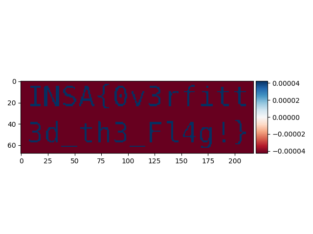

Another day, another neural CTF to solve!
This challenge is pretty straight-forward: a keras model is given as only file of the challenge.
The first I thought was: 

*Ehi, it's just another gradient descent! Let's try it!*... and **I failed hard**. 
The network doesn't compute anything, it just takes in input a greyscale 68 x 218 image and it outputs a number between 0 and 1.
Nothing special.
If you try to apply some gradient descent on the network, the result will be a useless image.

What to do now?
Having a look to a dump of the file containing the model was somehow enlighting:
```
00003330  b4 8a 32 b8 b4 8a 32 38  b4 8a 32 38 b4 8a 32 38  |..2...28..28..28|
00003340  b4 8a 32 38 b4 8a 32 b8  b4 8a 32 b8 b4 8a 32 b8  |..28..2...2...2.|
00003350  b4 8a 32 b8 b4 8a 32 b8  b4 8a 32 b8 b4 8a 32 b8  |..2...2...2...2.|
*
00003690  b4 8a 32 b8 b4 8a 32 b8  b4 8a 32 38 b4 8a 32 38  |..2...2...28..28|
000036a0  b4 8a 32 38 b4 8a 32 b8  b4 8a 32 b8 b4 8a 32 b8  |..28..2...2...2.|
000036b0  b4 8a 32 b8 b4 8a 32 b8  b4 8a 32 b8 b4 8a 32 b8  |..2...2...2...2.|
*
000037e0  b4 8a 32 38 b4 8a 32 38  b4 8a 32 38 b4 8a 32 b8  |..28..28..28..2.|
000037f0  b4 8a 32 b8 b4 8a 32 b8  b4 8a 32 b8 b4 8a 32 b8  |..2...2...2...2.|
*
000038e0  b4 8a 32 b8 b4 8a 32 b8  b4 8a 32 b8 b4 8a 32 38  |..2...2...2...28|
000038f0  b4 8a 32 38 b4 8a 32 38  b4 8a 32 38 b4 8a 32 38  |..28..28..28..28|
*
00003910  b4 8a 32 38 b4 8a 32 b8  b4 8a 32 b8 b4 8a 32 b8  |..28..2...2...2.|
00003920  b4 8a 32 b8 b4 8a 32 38  b4 8a 32 38 b4 8a 32 38  |..2...28..28..28|
00003930  b4 8a 32 b8 b4 8a 32 b8  b4 8a 32 b8 b4 8a 32 b8  |..2...2...2...2.|
00003940  b4 8a 32 b8 b4 8a 32 b8  b4 8a 32 b8 b4 8a 32 38  |..2...2...2...28|
00003950  b4 8a 32 38 b4 8a 32 38  b4 8a 32 b8 b4 8a 32 b8  |..28..28..2...2.|
00003960  b4 8a 32 b8 b4 8a 32 b8  b4 8a 32 b8 b4 8a 32 b8  |..2...2...2...2.|
00003970  b4 8a 32 b8 b4 8a 32 38  b4 8a 32 38 b4 8a 32 38  |..2...28..28..28|
00003980  b4 8a 32 38 b4 8a 32 38  b4 8a 32 38 b4 8a 32 b8  |..28..28..28..2.|
00003990  b4 8a 32 b8 b4 8a 32 b8  b4 8a 32 b8 b4 8a 32 b8  |..2...2...2...2.|
*
000039b0  b4 8a 32 b8 b4 8a 32 b8  b4 8a 32 38 b4 8a 32 38  |..2...2...28..28|
000039c0  b4 8a 32 38 b4 8a 32 b8  b4 8a 32 b8 b4 8a 32 b8  |..28..2...2...2.|
000039d0  b4 8a 32 b8 b4 8a 32 b8  b4 8a 32 b8 b4 8a 32 b8  |..2...2...2...2.|
*
000039f0  b4 8a 32 b8 b4 8a 32 b8  b4 8a 32 b8 b4 8a 32 38  |..2...2...2...28|
00003a00  b4 8a 32 38 b4 8a 32 b8  b4 8a 32 b8 b4 8a 32 b8  |..28..2...2...2.|
00003a10  b4 8a 32 b8 b4 8a 32 b8  b4 8a 32 b8 b4 8a 32 b8  |..2...2...2...2.|
*
00003a30  b4 8a 32 b8 b4 8a 32 38  b4 8a 32 38 b4 8a 32 38  |..2...28..28..28|
00003a40  b4 8a 32 38 b4 8a 32 38  b4 8a 32 b8 b4 8a 32 b8  |..28..28..2...2.|
00003a50  b4 8a 32 b8 b4 8a 32 b8  b4 8a 32 b8 b4 8a 32 b8  |..2...2...2...2.|
*
00003aa0  b4 8a 32 b8 b4 8a 32 b8  b4 8a 32 b8 b4 8a 32 38  |..2...2...2...28|
00003ab0  b4 8a 32 38 b4 8a 32 38  b4 8a 32 38 b4 8a 32 38  |..28..28..28..28|
00003ac0  b4 8a 32 38 b4 8a 32 38  b4 8a 32 b8 b4 8a 32 b8  |..28..28..2...2.|
00003ad0  b4 8a 32 b8 b4 8a 32 b8  b4 8a 32 b8 b4 8a 32 b8  |..2...2...2...2.|
*
00003b40  b4 8a 32 38 b4 8a 32 38  b4 8a 32 38 b4 8a 32 38  |..28..28..28..28|
00003b50  b4 8a 32 38 b4 8a 32 b8  b4 8a 32 b8 b4 8a 32 b8  |..28..2...2...2.|
00003b60  b4 8a 32 b8 b4 8a 32 b8  b4 8a 32 b8 b4 8a 32 b8  |..2...2...2...2.|
*
00003b80  b4 8a 32 38 b4 8a 32 38  b4 8a 32 b8 b4 8a 32 b8  |..28..28..2...2.|
00003b90  b4 8a 32 b8 b4 8a 32 b8  b4 8a 32 b8 b4 8a 32 b8  |..2...2...2...2.|
```
... they are kinda all the same, except some values.
This made me realize that maybe those weights are **fake**.

```python
import numpy as np
import skimage
import matplotlib.pyplot as plt
import keras
from keras.models import load_model
from keras import backend as K

SHAPE = (68, 218)
adv_image = np.array([np.ones(SHAPE)])
epsilon = 1

model = load_model('model')
print(model.summary())
weights = model.layers[1].get_weights()[0]
weights = weights.reshape(SHAPE)
print(weights, model.predict(np.array([weights])))
skimage.io.imshow(weights)
plt.show()
```
Some `skimage` magic for showing the weights and here it is the flag!

You can find all the files of tis challenge [HERE](files.zip).